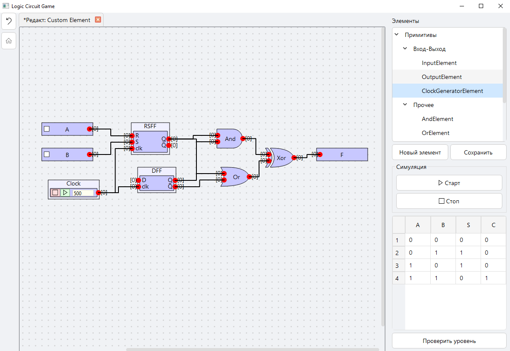
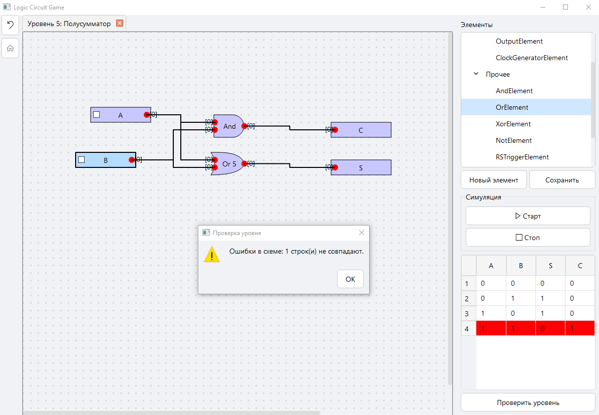
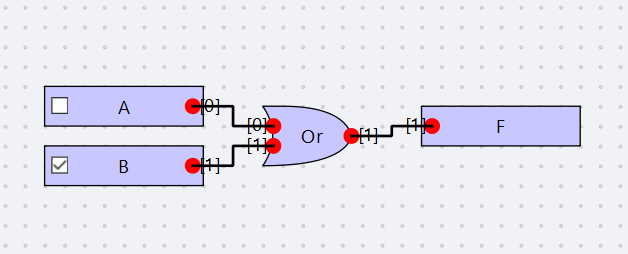
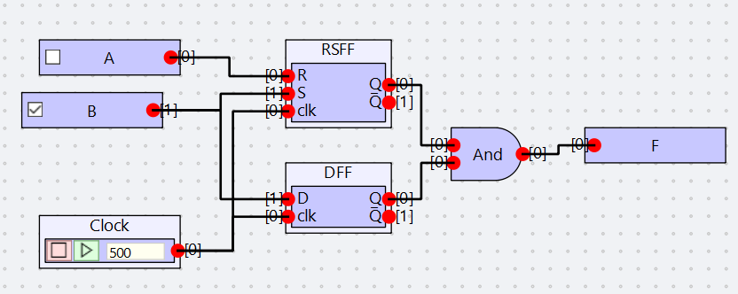
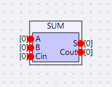

# LogicElementSimulation

LogicElementSimulation – учебный симулятор цифровых логических схем, в котором можно собирать собственные схемы из базовых логических элементов, проверять их работу и создавать переиспользуемые подсхемы.

Проект задуман как упрощённая версия подхода, который используется в инструменте Altera Quartus, но с акцентом на наглядное обучение.

Вместо написания VHDL кода схема собирается непосредственно в графическом интерфейсе:

## Возможности

### Построение логических схем

Схема собирается из логических элементов и соединений между ними.

Можно создавать собственные комбинационные и последовательностные схемы, соединяя базовые элементы в более сложные конструкции.

### Обучающие уровни

Проект содержит последовательность задач, позволяющих постепенно изучать устройство цифровых схем.

Результат работы можно проверять относительно таблицы истинности конкретного уровня.

Например:

Пользователь самостоятельно строит схему, после чего симулятор прогоняет необходимые комбинации входов и сравнивает полученный результат с ожидаемым.

### Уровни

Среди задач можно постепенно перейти от простых логических операций к более сложным цифровым устройствам:

* базовые логические элементы;
* полусумматор;
* полный сумматор;
* мультиплексоры;
* триггеры;
* последовательностные схемы;
* использование подсхем;
* построение более сложных компонентов из уже созданных элементов.

## Интерактивная симуляция

У схемы есть два основных режима работы.

### Интерактивный режим

Входы можно переключать непосредственно в интерфейсе:

Изменение входного сигнала сразу отображается на выходах схемы.

Это позволяет буквально пощупать собранную схему и увидеть распространение сигналов через элементы.

### Тактовая симуляция

Для последовательностных схем доступен режим пошаговой симуляции с использованием тактового сигнала.

Такой режим особенно полезен при работе с триггерами и другими элементами, состояние которых зависит от предыдущего такта.

## Пользовательские элементы и подсхемы

Одной из основных возможностей является создание собственных элементов из уже существующих схем.

Например, после построения сумматора его можно сохранить как отдельный компонент:

После этого компонент можно использовать в других схемах как обычный элемент.

Это позволяет строить достаточно сложные схемы без необходимости каждый раз заново создавать их внутреннюю структуру.

## Архитектура

Проект является в первую очередь практикой объектно-ориентированного проектирования.

Логические элементы представлены объектами, взаимодействующими через определённые интерфейсы.

При проектировании core использовались принципы SOLID.

В частности, ответственность за различные части системы разделена между отдельными компонентами:

* модель логического элемента;
* соединения и порты;
* хранение состояния;
* выполнение симуляции;
* тактовая логика;
* проверка решений;
* работа с пользовательскими подсхемами.

Такой подход позволяет расширять систему без необходимости переписывать движок целиком.

## Тестирование

Core проекта полностью покрыт модульными тестами на pytest.

## Что демонстрирует проект

* Object-Oriented Programming;
* SOLID;
* Design Patterns;
* Domain Modeling;
* Event-driven development;
* Unit testing.

---

## Автор

**duvean**

[GitHub](https://github.com/duvean)
